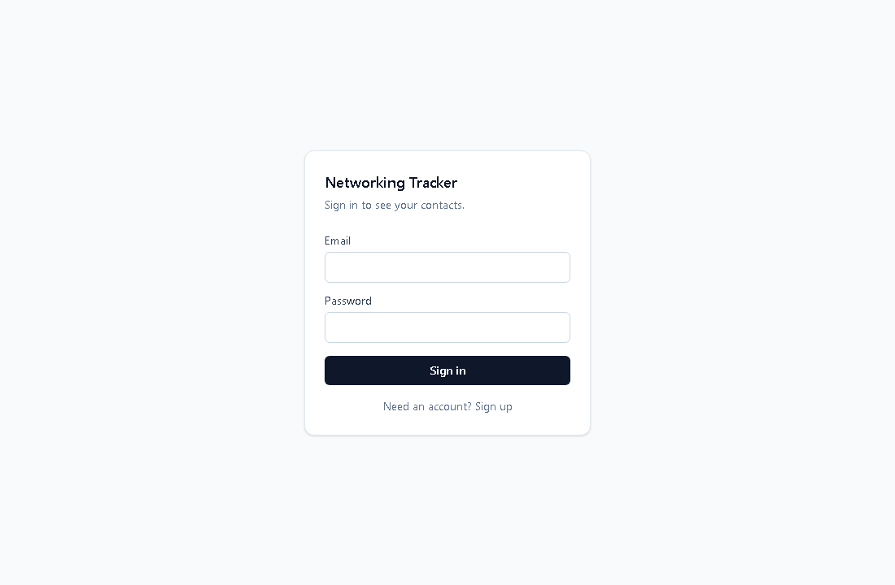
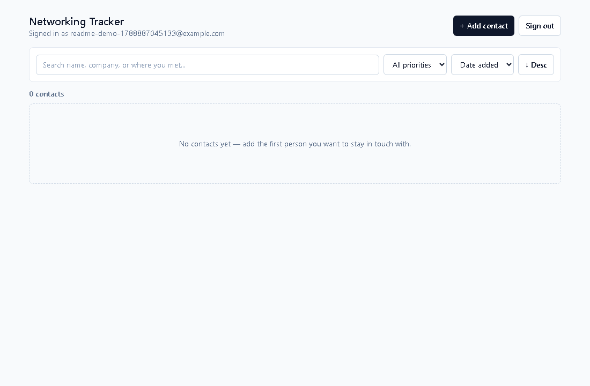
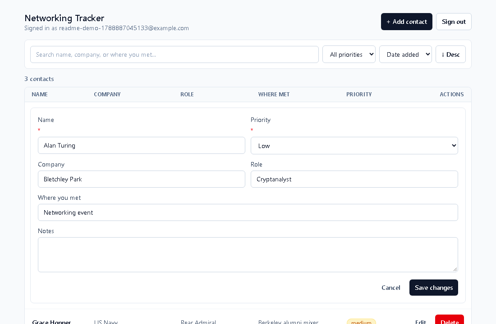
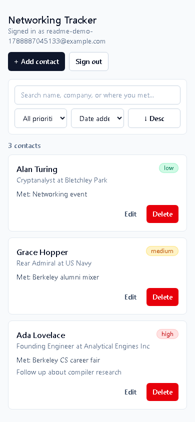

# Networking Tracker

A private contact tracker for the people you want to stay in touch with — built for a class assignment requiring Neon Postgres, Neon Managed Better Auth, the Neon Data API, Row-Level Security, a separated React frontend and Node backend, and a Vercel deployment. Each signed-in user sees only their own contacts: create, edit, delete, sort, and filter them, with ownership enforced at the database level (not just in application code).

## Live URL

**App:** https://frontend-sepia-ten-34.vercel.app
**Backend API:** https://backend-one-gules-64.vercel.app/api

## Screenshots / walkthrough

All screenshots below are from the live deployment, captured against a real (throwaway demo) account — not mockups.

1. **Sign in** — a minimal email/password form (Managed Better Auth). New users can switch to "Sign up" from the same screen.

   

2. **Empty state** — a fresh account shows "No contacts yet — add the first person you want to stay in touch with." instead of a bare blank page.

   

3. **Add a contact** — click "+ Add contact" in the header, fill in Name and Priority (required) plus Company / Role / Where you met / Notes (optional), submit.

   

   A green "Contact added." banner confirms success and the row appears immediately:

   

4. **Sort & filter** — the toolbar has a text search (matches name, company, or where-met), a priority filter, a sort-by dropdown (date added / name / priority / company), and an ascending/descending toggle. The screenshot above has the priority filter set to "High," correctly narrowing three contacts down to the one that matches.

5. **Edit / delete** — "Edit" swaps a row for an inline form pre-filled with that contact's data; "Delete" asks for confirmation, then removes the row.

   

6. **Validation errors** — leaving Name blank returns a clear inline error instead of silently failing; the same rule is enforced again server-side even if the browser's own check is bypassed (see [Security & RLS](#security--rls)).

   

7. **Mobile layout** — below the `md` breakpoint the table becomes a stack of cards instead of a horizontally-scrolling table, and the whole list (all 3 demo contacts) is visible without scrolling.

   

## Features

- Sign up / sign in / sign out via Neon Managed Better Auth
- Create, view, edit, delete contacts (name, company, role, where you met, notes, priority)
- Sort by name, priority, company, or date added, ascending or descending
- Filter by priority and free-text search across name/company/where-met
- Server-enforced validation: name required, priority restricted to `low` / `medium` / `high`
- Loading, empty, error, and success states throughout
- Responsive layout: table on desktop/tablet, stacked cards on mobile
- Database-level privacy: Row-Level Security means one user's contacts are structurally invisible to another, even if the backend had a bug

## Technology stack

| Layer | Choice | Why |
|---|---|---|
| Frontend | React 19 + Vite + TypeScript | Explicit requirement: a plain React frontend, kept separate from the backend (two deployable apps, not one framework doing both) |
| Styling | Tailwind CSS | A real design system (spacing/color/typography tokens) with minimal dependency weight and responsive utilities built in, rather than hand-rolled CSS |
| Backend | Node.js + Express + TypeScript | Explicit requirement: a separate Node backend, so field validation and JWT verification run in trusted server code, not just the browser |
| Database | Neon Postgres | Serverless Postgres with branching, required by the assignment |
| Auth | Neon Managed Better Auth | Hosted auth (email/password), issues short-lived JWTs Postgres can verify directly via `auth.user_id()` |
| Data access | Neon Data API + `@neondatabase/neon-js` | A PostgREST-compatible REST layer over Postgres that enforces Row-Level Security per request, using the SDK's two-URL (`auth` + `dataApi`) client form |
| Hosting | Vercel | Required by the assignment; frontend and backend deploy as two separate Vercel projects |
| Infra-as-code | `neon` CLI + `neon.ts` (`@neon/config`) | Declares "Auth: on, Data API: on" as code (`neon deploy`) instead of manual console clicking, so the project's Neon configuration is reviewable and reproducible |

## Architecture

```
                          ┌─────────────────────────┐
  Browser  ───(1) auth───▶│  Neon Managed Better Auth │
     │                    └─────────────────────────┘
     │  (2) Bearer JWT
     ▼
┌───────────────────┐   (3) verify JWT (JWKS)   ┌──────────────────────┐
│  React frontend    │──────────────────────────▶│   Node/Express        │
│  (Vite, Tailwind)   │   REST calls, JWT in       │   backend              │
│  no DB/auth secrets │   Authorization header     │  - JWT verification    │
└───────────────────┘◀─────────────────────────│  - field validation    │
                          JSON responses          │  - forwards JWT        │
                                                   └──────────┬───────────┘
                                                              │ (4) same JWT forwarded
                                                              ▼
                                                   ┌──────────────────────┐
                                                   │   Neon Data API       │
                                                   │  (PostgREST-style)    │
                                                   │  enforces RLS using   │
                                                   │  auth.user_id()       │
                                                   └──────────┬───────────┘
                                                              ▼
                                                   ┌──────────────────────┐
                                                   │  Neon Postgres         │
                                                   │  contacts table + RLS  │
                                                   └──────────────────────┘
```

**Frontend** (`frontend/`) only ever talks to two things: Managed Better Auth (sign up/in/out, session) directly, and this app's own backend for every contact read/write. It never holds `DATABASE_URL` and never queries the Data API directly — `@neondatabase/neon-js`'s `dataApi.url` is still configured on the client (the two-URL object form the assignment asks for), but the app deliberately routes contact reads/writes through the backend instead of calling `.from('contacts')` from the browser, so validation runs in trusted server code (see [Security](#security--rls)).

**Backend** (`backend/`) is the trusted boundary. `src/middleware/auth.ts` verifies the caller's JWT against Managed Better Auth's JWKS endpoint before anything else runs. `src/lib/validation.ts` enforces "name required" and "priority ∈ {low, medium, high}" — pure functions, unit tested. `src/lib/neonClient.ts` then makes the actual Data API call, using `@neondatabase/neon-js`'s external-token client form (`dataApi.getToken`) to forward the exact, already-verified caller JWT for that one request — see the comment in that file for why this backend doesn't use the two-URL form's built-in session management (it's designed for one persistent browser session, not a stateless server handling many different signed-in users concurrently).

**Database**: `contacts` table with Row-Level Security — see [Schema](#database-schema) and [Security](#security--rls).

## Local setup

Requires Node.js 20+.

```bash
git clone <this-repo-url>
cd networkingtracker
```

### 1. Neon project

You need a Neon project with **Managed Better Auth** and the **Data API** enabled. Either:

- **Console**: Neon Console → your project → Data API page → check "Use Managed Better Auth" → Enable Data API. Copy the Auth URL and Data API URL from the Data API and Auth pages.
- **CLI** (what this repo was actually built with — see `neon.ts` at the repo root):
  ```bash
  npm i -g neon@latest
  neon login
  neon link --project-id <your-project-id> --branch production
  neon deploy   # applies neon.ts: auth: true, dataApi: true
  ```
  `neon deploy` writes `DATABASE_URL`, `NEON_AUTH_BASE_URL`, `NEON_AUTH_JWKS_URL`, and `NEON_DATA_API_URL` into a root-level `.env.local` (gitignored) — copy the values you need into `backend/.env.local` and `frontend/.env.local` below.

### 2. Backend

```bash
cd backend
npm install
cp .env.example .env.local   # fill in DATABASE_URL, NEON_AUTH_BASE_URL, NEON_AUTH_JWKS_URL, NEON_DATA_API_URL
npm run migrate              # creates contacts table + RLS policies
npm run dev                  # http://localhost:3001
```

### 3. Frontend

```bash
cd frontend
npm install
cp .env.example .env.local   # fill in VITE_NEON_AUTH_BASE_URL, VITE_NEON_DATA_API_URL, VITE_API_URL
npm run dev                  # http://localhost:5173
```

Open `http://localhost:5173`, sign up, and start adding contacts.

## Environment variables

Real values only ever live in `.env.local` files (gitignored, never committed). `.env.example` in each app documents the required **names** with placeholders.

**`backend/.env.example`**
| Variable | Secret? | Purpose |
|---|---|---|
| `DATABASE_URL` | **Yes — server-only** | Used only by `db/migrate.ts` to apply the schema. Never read by any API route, never sent to the browser. |
| `NEON_AUTH_BASE_URL` | No (public URL) | Managed Better Auth's base URL — used to build the JWKS URL fallback and to check the JWT `iss` claim. |
| `NEON_AUTH_JWKS_URL` | No (public URL) | Exact JWKS endpoint used to verify incoming JWTs. |
| `NEON_DATA_API_URL` | No (public URL) | The Neon Data API endpoint this backend forwards verified requests to. |
| `FRONTEND_URL` | No | Origin allowed through CORS. |
| `PORT` | No | Local dev port (defaults to 3001). |

**`frontend/.env.example`**
| Variable | Secret? | Purpose |
|---|---|---|
| `VITE_NEON_AUTH_BASE_URL` | No (public URL) | Passed to `@neondatabase/neon-js` for sign up/in/out and session. |
| `VITE_NEON_DATA_API_URL` | No (public URL) | Completes the SDK's two-URL client form (see [Architecture](#architecture) for why the frontend doesn't call it directly). |
| `VITE_API_URL` | No | This app's own backend URL. |

The assignment's reference names (`NEXT_PUBLIC_NEON_AUTH_URL`, `NEXT_PUBLIC_NEON_DATA_API_URL`) assume a Next.js frontend; this app uses Vite (per the "React frontend, Node backend" requirement), so public vars use Vite's required `VITE_` prefix and Neon's own canonical names (`NEON_AUTH_BASE_URL`, `NEON_DATA_API_URL`) instead — same values, different prefix convention. `DATABASE_URL` stays server-only exactly as required either way.

## Database schema

`backend/db/schema.sql` (idempotent — safe to re-run):

| Column | Type | Notes |
|---|---|---|
| `id` | `bigint` | Primary key, identity column |
| `user_id` | `text` | `not null default auth.user_id()` — owner of the row |
| `name` | `text` | `not null` |
| `company` | `text` | optional |
| `role` | `text` | optional |
| `where_met` | `text` | optional |
| `notes` | `text` | optional |
| `priority` | `text` | `not null check (priority in ('low','medium','high'))` |
| `created_at` | `timestamptz` | `not null default now()` |
| `updated_at` | `timestamptz` | `not null default now()` |

## Security & RLS

- **RLS is enabled** on `contacts`, with **four separate policies** (not one catch-all `FOR ALL`):
  - `contacts_select_own` — `FOR SELECT USING (auth.user_id() = user_id)`
  - `contacts_insert_own` — `FOR INSERT WITH CHECK (auth.user_id() = user_id)`
  - `contacts_update_own` — `FOR UPDATE USING (auth.user_id() = user_id) WITH CHECK (auth.user_id() = user_id)`
  - `contacts_delete_own` — `FOR DELETE USING (auth.user_id() = user_id)`
- The `UPDATE` policy's `WITH CHECK` is what stops a user from reassigning a row to someone else — even if they tried to set `user_id` to another account's id in a PATCH request, the check re-evaluates `auth.user_id() = user_id` against the *new* row and rejects it.
- `user_id` defaults to `auth.user_id()` and is `NOT NULL`; the backend never accepts `user_id` from the request body, so ownership is always assigned by the database from the caller's verified JWT, not by client-supplied data.
- **Validation is enforced server-side**, independent of the browser: `backend/src/lib/validation.ts` (required name, `priority` enum) runs before any database write, and the `priority` `CHECK` constraint enforces the same rule at the database layer as a second, independent guarantee.
- **Two-account isolation was verified directly against the live Neon Data API** (not just assumed from the RLS policy text) — two real accounts were created, a contact inserted as account A, and account B's JWT was used to attempt `SELECT`, `UPDATE`, and `DELETE` against that row: all three returned an empty result (RLS makes the row simply not exist from account B's perspective), and account A's row was confirmed unchanged afterward. To reproduce:
  1. Sign up as `a@example.com`, add a contact.
  2. Sign out, sign up as `b@example.com`.
  3. Confirm the contact list is empty for `b@example.com`.
  4. (Optional, proves it at the API level too) Get each account's JWT via `GET {NEON_AUTH_BASE_URL}/token` with that account's session cookie, then `curl` the Data API directly as account B against account A's contact `id` — every method returns an empty array, never the row or an error leaking its existence.
- **Secrets**: `DATABASE_URL` is the only real secret in this project. It is read only by `backend/db/migrate.ts`, is listed only as a placeholder in `.env.example`, and is gitignored everywhere it appears (`.env.local` in the repo root, `backend/`, and `frontend/`). The Auth and Data API URLs are not secrets — they're meant to be public per Neon's own documentation, and the assignment's own env var list treats them as public variables.

## Testing

```bash
cd backend
npm test
```

Runs `backend/test/validation.test.ts` (Node's built-in test runner) against `backend/src/lib/validation.ts` — the same pure functions the API routes call before touching the database. It checks: a missing or whitespace-only name is rejected; an invalid priority value is rejected; a missing priority is rejected on create; a full valid payload is accepted and optional fields are trimmed/normalized; partial-update mode allows omitted fields but still rejects a present-but-invalid priority or an explicit empty name.

This test suite deliberately does not hit a live database — RLS/two-account behavior is verified against real infrastructure as described above, not mocked, since RLS policies are meaningless to test against a mock.

## Deployment

Two separate Vercel projects — this is what "frontend and backend separated" means at deploy time, not just in the repo layout.

**Backend** (`backend/`):
```bash
cd backend
vercel
```
Set `DATABASE_URL`, `NEON_AUTH_BASE_URL`, `NEON_AUTH_JWKS_URL`, `NEON_DATA_API_URL`, and `FRONTEND_URL` (the frontend's eventual Vercel URL) as environment variables in the Vercel project dashboard. `backend/vercel.json` routes all requests to `api/index.ts`, a thin wrapper around the same Express `app` used locally.

**Frontend** (`frontend/`):
```bash
cd frontend
vercel
```
Set `VITE_NEON_AUTH_BASE_URL`, `VITE_NEON_DATA_API_URL`, and `VITE_API_URL` (the backend's deployed URL, e.g. `https://your-backend.vercel.app/api`) as environment variables in the Vercel project dashboard, then redeploy so the build picks them up.

Once both are live, update `FRONTEND_URL` on the backend project (and redeploy it) to the frontend's real URL so CORS allows it.

**Trusted domain (easy to miss):** Managed Better Auth rejects sign-in/sign-up requests from an origin it doesn't recognize (`{"code":"INVALID_ORIGIN"}`, HTTP 403) — `localhost` works out of the box, but a deployed URL doesn't until you add it:
```bash
neon neon-auth domain add https://your-frontend.vercel.app
```
(or via the Neon Console's Auth → Configuration → Trusted Domains page). Do this once per deployed frontend URL.

## Known limitations / what's next

- No password reset / email verification flow — Managed Better Auth supports both, just not wired into this UI yet.
- No pagination — `GET /api/contacts` returns the full list; fine for a personal contact tracker, not for thousands of rows.
- No optimistic UI updates — every action refetches the list rather than patching local state (except delete, which does update locally).
- The frontend production bundle isn't code-split (single ~560KB JS chunk); fine at this scale, would split by route if the app grew.
- No CI — tests run manually; a GitHub Actions workflow running `npm test` on push would be the next addition.
